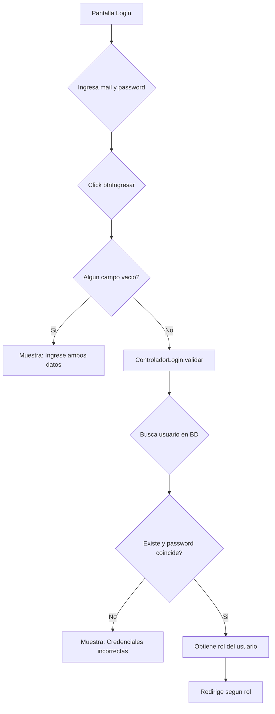
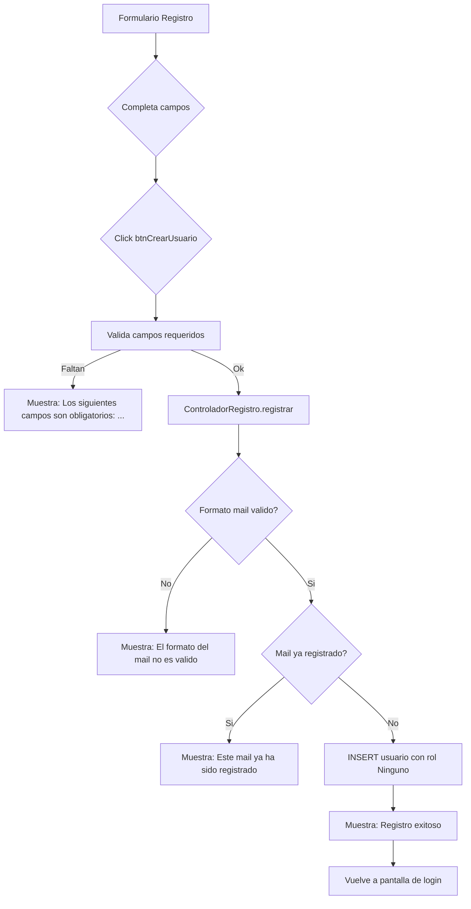
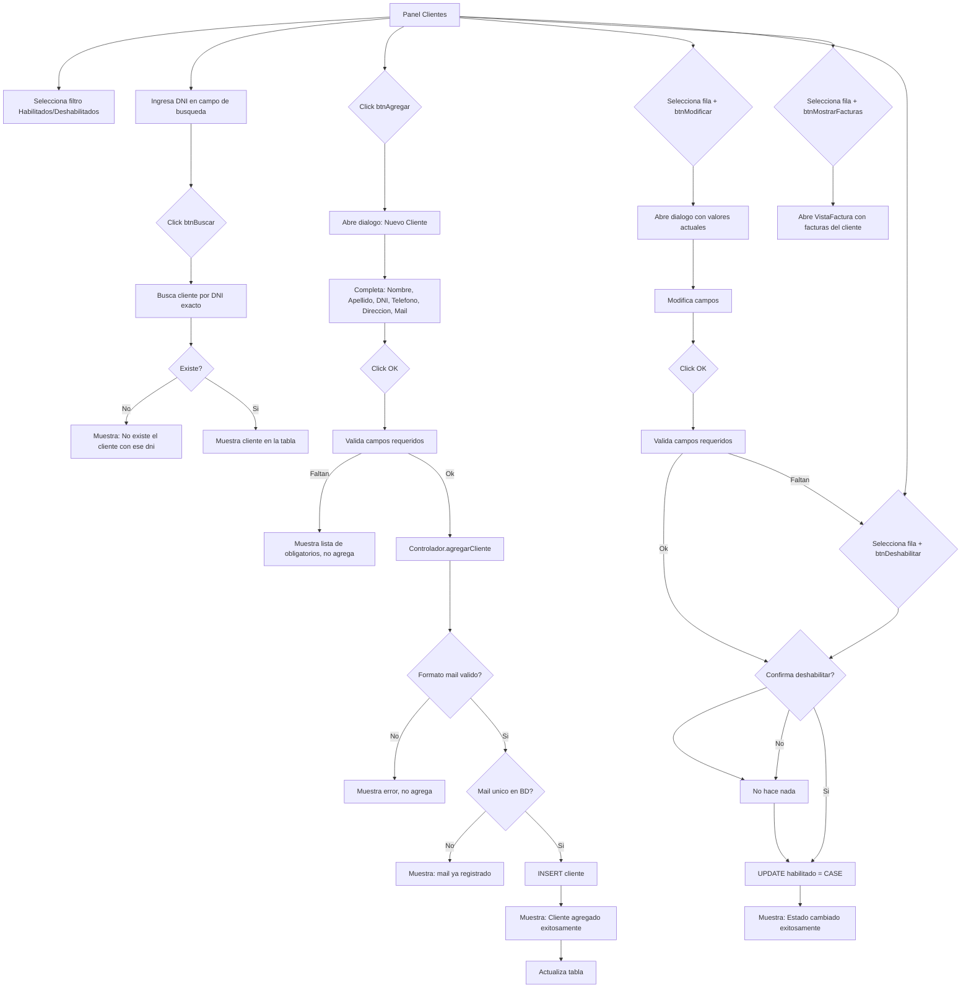
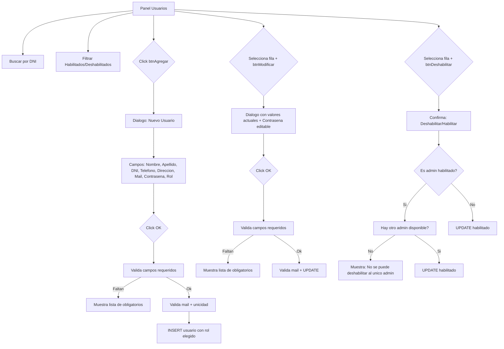
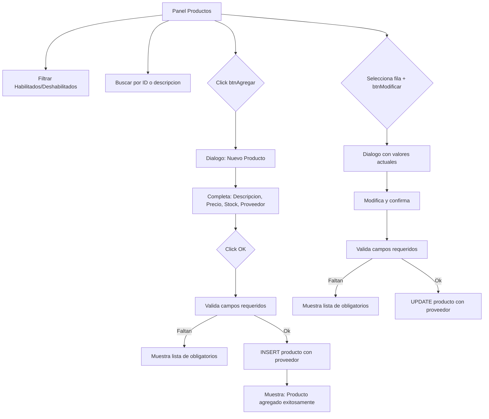
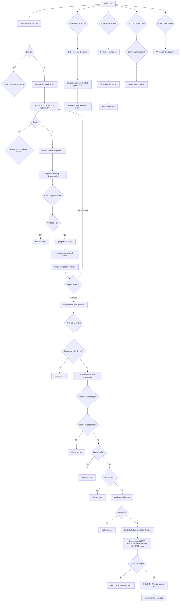

# Sistema Facturador -- Guia de uso

## 1. Ingreso al sistema

### 1.1 Inicio de sesion

Al ejecutar la aplicacion, se muestra la pantalla de login con dos campos:

- **Mail:** Ingrese su correo electronico registrado
- **Contrasena:** Ingrese su contrasena (oculta con asteriscos)

**Botones:**
- **Ingresar:** Valida credenciales y redirige segun el rol del usuario
- **Crear cuenta:** Abre el formulario de registro

### 1.2 Crear cuenta

Al hacer click en "Crear cuenta" se abre el formulario de registro con
los siguientes campos:

- Nombre (solo letras y espacios)
- Apellido (solo letras y espacios)
- DNI (solo digitos)
- Telefono (solo digitos)
- Direccion (letras, digitos y caracteres especiales)
- Mail (sin filtro en tiempo real)
- Contrasena (oculta con asteriscos)

Al registrarse, el nuevo usuario obtiene el rol `"Ninguno"`.
Un administrador debe asignarle un rol desde el panel de gestion
de usuarios.

---

## 2. Rol Administrador

### 2.1 Panel principal

Al iniciar sesion como Administrador, se muestra el panel principal
con las siguientes opciones:

- **Administrar Clientes** -- ABM completo de clientes
- **Administrar Proveedores** -- ABM de proveedores
- **Administrar Usuarios** -- Gestion de usuarios del sistema
- **Administrar Deposito** -- Gestion de stock/productos
- **Facturar** -- Modulo de ventas (mismo que el rol Cajero)
- **Cerrar Sesion** -- Vuelve al login

### 2.2 Gestion de clientes

**Campos del formulario:**

| Campo | Filtro en tiempo real | Validacion adicional |
|---|---|---|
| Nombre | Solo letras + espacios | -- |
| Apellido | Solo letras + espacios | -- |
| DNI | Solo digitos | -- |
| Telefono | Solo digitos | -- |
| Direccion | Letras, digitos, @._- | -- |
| Mail | Sin filtro | Formato xxxx@xxxx.xxx al enviar |

**Busqueda:** Ingresar DNI exacto en el campo `tfDni` (FiltroNumerico)
y click en "Buscar". Si se deja vacio y se busca, muestra todos los
clientes del filtro seleccionado.

### 2.3 Gestion de proveedores

Idem clientes pero con los campos: Nombre, Telefono, Direccion, Mail.
La busqueda se realiza por ID (numerico). No tiene modulo de facturas.

### 2.4 Gestion de usuarios

**Particularidades:**
- La columna "Habilitado" esta oculta en la tabla
- El campo Contrasena se muestra como JPasswordField
- Rol se selecciona de un JComboBox (Administrador, Cajero, Deposito)
- Al modificar, el campo Contrasena trae el valor actual

### 2.5 Gestion de deposito (productos)

**Particularidades:**
- La busqueda acepta tanto ID numerico como texto (busca por descripcion LIKE)
- No tiene validacion de mail (los productos no tienen mail)
- Precio y Stock usan FiltroNumerico
- Descripcion y Proveedor son campos obligatorios
- Proveedor se selecciona de un JComboBox cargado con proveedores habilitados

---

## 3. Rol Cajero -- Proceso de venta

### 3.1 Seleccion de cliente

1. Ingresar DNI del cliente en el campo `tfBuscarCliente`
2. Click en "Buscar cliente"
3. Si existe: se cargan automaticamente todos los datos del cliente
   (nombre, apellido, DNI, direccion, telefono, mail)
4. Si no existe: se muestra mensaje y se limpian los campos

Si el cliente no existe, se puede crear uno nuevo con `btnNuevoCliente`.
Tambien se puede modificar el cliente seleccionado con `btnModificarCliente`.

### 3.2 Seleccion de producto

1. Ingresar ID o descripcion en `tfBuscarProducto`
2. Click en "Buscar producto"
3. Si existe exactamente 1: se cargan descripcion, precio y stock
4. Si hay multiples: se muestra una lista para seleccionar cual cargar
5. Si no existe: se puede crear uno nuevo con `btnNuevoProducto`

### 3.3 Agregar al carrito

1. Ingresar cantidad (debe ser > 0)
2. Opcional: ingresar descuento % para ese producto
3. Click "Agregar al carro"
4. Se agrega una fila a la tabla del carrito con:
   ID, Descripcion, Precio Unit., Cantidad, Descuento %, Subtotal
5. El subtotal general se actualiza automaticamente

### 3.4 Gestion del carrito

- **Modificar articulo:** seleccionar fila, click "Modificar articulo",
  cambiar cantidad y/o descuento
- **Eliminar articulo:** seleccionar fila, click "Eliminar articulo",
  confirmar
- **Cancelar compra:** elimina todos los articulos del carrito

### 3.5 Calcular total y finalizar

1. Opcional: ingresar descuento global en `tfDescuento` (0-100)
2. Click "Calcular total" -> muestra total y valor descontado
3. Click "Finalizar compra"
4. Validaciones:
   - Debe haber un cliente seleccionado
   - El carrito no puede estar vacio
   - Debe haberse calculado el total
5. Confirmacion: "Confirmar finalizacion de la compra?"
6. Si ok: transaccion en BD que incluye:
   - INSERT en tabla facturas
   - INSERT batch en detalles_de_facturas
   - UPDATE stock de cada producto
   - Si algun producto tiene stock insuficiente -> rollback + error
7. Exito: muestra "Compra finalizada exitosamente. Factura N°: ..."
   y limpia todo para una nueva venta

### 3.6 Ver facturas de un cliente

Desde el panel de Administrador, seleccionar un cliente en la tabla
y click en "Mostrar facturas". Se abre una vista con:

- Lista de facturas del cliente (N°, Fecha, Total, Vendedor)
- Click en "Ver detalle" para ver la factura completa:
  - Numero de factura y fecha
  - Datos del cliente y vendedor
  - Subtotal, descuento, valor descontado, total
  - Tabla con los productos comprados (cantidad, precio unitario,
    descuento, subtotal)

---

## 4. Rol Deposito

El usuario con rol Deposito ve directamente el panel de gestion de
productos (VistaDepositoABM) al iniciar sesion.

**Funcionalidades:**
- Filtrar productos habilitados/deshabilitados
- Buscar producto por ID o descripcion
- Agregar nuevo producto (descripcion, precio, stock)
- Modificar producto existente
- Deshabilitar/habilitar producto

No tiene acceso a clientes, proveedores, usuarios ni modulo de ventas.

---

## 5. Mensajes de error comunes

| Mensaje | Donde aparece | Causa probable |
|---|---|---|
| "Ingrese ambos datos" | Login | Mail o password vacio |
| "Credenciales incorrectas" | Login | Mail no existe o password incorrecto |
| "Sin rol asignado" | Login | Usuario registrado con rol Ninguno |
| "El formato del mail no es valido" | ABMs / Registro | Mail no cumple formato xxxx@xxxx.xxx |
| "Este mail ya ha sido registrado" | Agregar cliente/proveedor/usuario | Mail duplicado en BD |
| "Ese mail ya pertenece a otro cliente" | Modificar cliente | Mail ya usado por otro registro |
| "Los siguientes campos son obligatorios: ..." | Registro / ABMs | Campos requeridos vacios (Nombre, Apellido, DNI, Mail, Password, Proveedor, etc.) |
| "No se puede deshabilitar al unico administrador habilitado" | Gestion Usuarios | Intento de deshabilitar el unico admin activo |
| "No existe el cliente con ese dni" | Buscar cliente | DNI no encontrado |
| "Seleccione un cliente de la tabla" | Modificar cliente | Ninguna fila seleccionada |
| "Seleccione un proveedor de la tabla" | Modificar proveedor | Ninguna fila seleccionada |
| "La cantidad debe ser mayor a 0" | Agregar al carro | Cantidad <= 0 |
| "El descuento debe ser entre 0 y 100" | Calcular total / Modificar articulo | Descuento fuera de rango |
| "Debe seleccionar un cliente" | Finalizar compra | No hay cliente cargado |
| "El carrito esta vacio" | Finalizar compra | No hay productos en el carrito |
| "Debe calcular el total primero" | Finalizar compra | No se calculo el total |
| "Stock insuficiente para el producto ID: N" | Finalizar compra | Stock menor a la cantidad solicitada |
| "No hay producto seleccionado" | Modificar/Agregar al carro | No se busco un producto primero |
| "No hay articulos en el carrito" | Calcular total | Carrito vacio |
