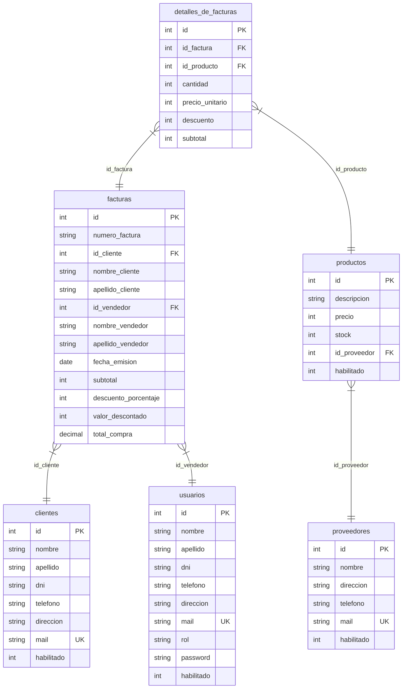

# Sistema Facturador -- Documentación técnica

## 1. Visión general

Sistema de facturación con interfaz gráfica Swing y base de datos
MySQL. Permite gestionar clientes, proveedores, productos, usuarios
y facturas con 3 roles de acceso: Administrador, Cajero y Depósito.

### Stack tecnológico

- **Lenguaje:** Java (JDK 21+)
- **GUI:** Java Swing con IntelliJ GUI Designer (.form)
- **Base de datos:** MySQL 8.0+ con driver JDBC (mysql-connector-java)
- **IDE:** IntelliJ IDEA
- **Compilación:** vía IntelliJ (Run 'main' F5), sin Maven/Gradle

### Roles del sistema

| Rol | Acceso |
|---|---|
| Administrador | ABM completo de clientes, proveedores, usuarios, productos + módulo de ventas |
| Cajero | Ventas (buscar/crear cliente, carrito, descuentos, finalizar compra) + módulo de facturas |
| Depósito | Gestión de stock: ABM de productos, filtrar por habilitado |

---

## 2. Arquitectura

```
src/
├── Main.java                          Punto de entrada
├── aplicacion/
│   ├── controladores/                 Logica de negocio, SQL
│   │   ├── ControladorLogin.java      Autenticacion de usuarios
│   │   ├── ControladorRegistro.java   Creacion de cuentas nuevas
│   │   ├── ControladorAdmin.java      Navegacion del panel Admin
│   │   ├── ControladorClienteABM.java CRUD de clientes
│   │   ├── ControladorProveedorABM.java CRUD de proveedores
│   │   ├── ControladorUsuarioABM.java CRUD de usuarios
│   │   ├── ControladorDepositoABM.java CRUD de productos
│   │   ├── ControladorCajero.java    Logica de ventas y facturacion
│   │   └── ControladorFactura.java   Consulta de facturas y detalles
│   ├── vistas/                       Interfaces graficas
│   │   ├── VentanaPrincipal.java     JFrame principal que contiene los paneles
│   │   ├── VistaLogin.java           Pantalla de inicio de sesion
│   │   ├── VistaRegistro.java        Formulario de registro
│   │   ├── VistaAdmin.java           Panel principal del Administrador
│   │   ├── VistaFormulario.java      Dialogo generico para formularios
│   │   ├── VistaClienteABM.java      ABM de clientes
│   │   ├── VistaProveedorABM.java    ABM de proveedores
│   │   ├── VistaUsuarioABM.java      ABM de usuarios
│   │   ├── VistaDepositoABM.java     ABM de productos
│   │   ├── VistaCajero.java          Interfaz de caja/ventas
│   │   ├── VistaFactura.java         Listado de facturas por cliente
│   │   └── VistaDetallesFactura.java Detalle de una factura
│   ├── modelos/                      Clases POJO
│   │   ├── Usuario.java
│   │   ├── Cliente.java
│   │   ├── Proveedor.java
│   │   ├── Producto.java
│   │   ├── Factura.java
│   │   └── DetalleFactura.java
│   ├── servicios/                    Infraestructura
│   │   ├── Conexion.java             Conexion a MySQL
│   │   └── Autenticacion.java        Validacion de credenciales
│   ├── filtros/                      Validacion de entrada
│   │   ├── FiltroNumerico.java       Solo digitos
│   │   ├── FiltroTexto.java          Solo letras + espacios
│   │   ├── FiltroAlfanumerico.java   Letras, digitos, @._-
│   │   ├── ValidadorMail.java        Validacion de formato email
│   │   ├── ValidadorCampos.java      Validacion de campos requeridos
│   │   └── ValidadorCantidadAdmin.java  Evita deshabilitar ultimo admin
│   └── database/                     Scripts SQL
│       └── 2106.sql                  Dump de la BD comercial
```

### Flujo de inicio

```mermaid
flowchart TD
    A[Main.java - void main()] --> B[Crea VentanaPrincipal]
    B --> C[Crea ControladorLogin]
    C --> D[Muestra VistaLogin]
    D --> E{Usuario ingresa mail + password}
    E --> F{validar() exitoso?}
    F -->|No| G[Muestra error]
    F -->|Si| H{iniciarSesion segun rol}
    H -->|Administrador| I[VistaAdmin]
    H -->|Cajero| J[VistaCajero]
    H -->|Deposito| K[VistaDepositoABM]
    H -->|Ninguno| L[Mensaje: sin rol asignado]
```

---

## 3. Base de datos

Base: `comercial` (MySQL), host: `localhost:3306`, user: `root`.

### Diagrama de relaciones



### Tabla: `clientes`

| Columna | Tipo | Restricciones |
|---|---|---|
| id | INT | PK, AUTO_INCREMENT |
| nombre | VARCHAR(100) | NOT NULL |
| apellido | VARCHAR(100) | NOT NULL |
| dni | VARCHAR(20) | NOT NULL |
| telefono | VARCHAR(20) | DEFAULT NULL |
| direccion | VARCHAR(255) | DEFAULT NULL |
| mail | VARCHAR(100) | NOT NULL, UNIQUE |
| habilitado | INT | DEFAULT 1 |

### Tabla: `proveedores`

| Columna | Tipo | Restricciones |
|---|---|---|
| id | INT | PK, AUTO_INCREMENT |
| nombre | VARCHAR(100) | DEFAULT NULL |
| direccion | VARCHAR(150) | DEFAULT NULL |
| telefono | VARCHAR(30) | DEFAULT NULL |
| mail | VARCHAR(60) | NOT NULL, UNIQUE |
| habilitado | INT | DEFAULT 1 |

### Tabla: `productos`

| Columna | Tipo | Restricciones |
|---|---|---|
| id | INT | PK, AUTO_INCREMENT |
| descripcion | VARCHAR(255) | NOT NULL |
| precio | INT | NOT NULL |
| stock | INT | NOT NULL |
| id_proveedor | INT | DEFAULT NULL, FK → proveedores(id) |
| habilitado | INT | DEFAULT 1 |

### Tabla: `usuarios`

| Columna | Tipo | Restricciones |
|---|---|---|
| id | INT | PK, AUTO_INCREMENT |
| nombre | VARCHAR(100) | DEFAULT NULL |
| apellido | VARCHAR(100) | DEFAULT NULL |
| dni | VARCHAR(10) | DEFAULT NULL |
| telefono | VARCHAR(30) | DEFAULT NULL |
| direccion | VARCHAR(150) | DEFAULT NULL |
| mail | VARCHAR(60) | NOT NULL, UNIQUE |
| rol | VARCHAR(20) | DEFAULT NULL |
| password | VARCHAR(20) | DEFAULT NULL |
| habilitado | INT | DEFAULT 1 |

### Tabla: `facturas`

| Columna | Tipo | Restricciones |
|---|---|---|
| id | INT | PK, AUTO_INCREMENT |
| numero_factura | VARCHAR(50) | NOT NULL |
| id_cliente | INT | NOT NULL, FK → clientes(id) |
| nombre_cliente | VARCHAR(100) | NOT NULL |
| apellido_cliente | VARCHAR(100) | NOT NULL |
| id_vendedor | INT | NOT NULL, FK → usuarios(id) |
| nombre_vendedor | VARCHAR(100) | NOT NULL |
| apellido_vendedor | VARCHAR(100) | NOT NULL |
| fecha_emision | DATE | NOT NULL |
| subtotal | INT | NOT NULL DEFAULT 0 |
| descuento_porcentaje | INT | NOT NULL DEFAULT 0 |
| valor_descontado | INT | NOT NULL DEFAULT 0 |
| total_compra | DECIMAL(10,2) | NOT NULL |

### Tabla: `detalles_de_facturas`

| Columna | Tipo | Restricciones |
|---|---|---|
| id | INT | PK, AUTO_INCREMENT |
| id_factura | INT | NOT NULL, FK → facturas(id) ON DELETE CASCADE |
| id_producto | INT | NOT NULL, FK → productos(id) |
| cantidad | INT | NOT NULL |
| precio_unitario | INT | NOT NULL |
| descuento | INT | DEFAULT 0 |
| subtotal | INT | DEFAULT 0 |

---

## 4. Referencia de clases

### 4.1 Paquete `aplicacion.modelos`

---

#### Usuario.java

```java
package aplicacion.modelos;

public class Usuario {
    private int id;
    private String nombre, apellido, dni, telefono, direccion, mail, rol, password;
    private int habilitado;
}
```

Constructor vacío. Getters y setters para todos los campos.

| Campo | Tipo | Descripción |
|---|---|---|
| id | int | Identificador único |
| nombre | String | Nombre del usuario |
| apellido | String | Apellido del usuario |
| dni | String | Documento de identidad |
| telefono | String | Número telefónico |
| direccion | String | Domicilio |
| mail | String | Correo electrónico (UNIQUE en BD) |
| rol | String | Administrador, Cajero, Depósito o Ninguno |
| password | String | Contraseña en texto plano |
| habilitado | int | 1 = activo, 0 = deshabilitado |

---

#### Cliente.java

```java
package aplicacion.modelos;

public class Cliente {
    private int id;
    private String nombre, apellido, dni, telefono, direccion, mail;
    private int habilitado;
}
```

Constructor vacío. Getters y setters.

| Campo | Tipo | Descripción |
|---|---|---|
| id | int | Identificador único |
| nombre | String | Nombre del cliente |
| apellido | String | Apellido del cliente |
| dni | String | Documento de identidad |
| telefono | String | Número telefónico |
| direccion | String | Domicilio |
| mail | String | Correo electrónico (UNIQUE en BD) |
| habilitado | int | 1 = activo, 0 = deshabilitado |

---

#### Proveedor.java

```java
package aplicacion.modelos;

public class Proveedor {
    private int id;
    private String nombre, direccion, telefono, mail;
    private int habilitado;
}
```

Constructor vacío y constructor completo. Getters y setters.

| Campo | Tipo | Descripción |
|---|---|---|
| id | int | Identificador único |
| nombre | String | Nombre del proveedor |
| direccion | String | Domicilio |
| telefono | String | Número telefónico |
| mail | String | Correo electrónico (UNIQUE en BD) |
| habilitado | int | 1 = activo, 0 = deshabilitado |

---

#### Producto.java

```java
package aplicacion.modelos;

public class Producto {
    private int id;
    private String descripcion;
    private int precio, stock, habilitado;
    private int idProveedor;
    private String nombreProveedor;
}
```

Constructor vacío y constructores con parámetros. Getters y setters.

| Campo | Tipo | Descripción |
|---|---|---|
| id | int | Identificador único |
| descripcion | String | Nombre o descripción del producto |
| precio | int | Precio unitario en pesos |
| stock | int | Cantidad disponible |
| habilitado | int | 1 = activo, 0 = deshabilitado |
| idProveedor | int | FK hacia proveedores(id), 0 si no tiene |
| nombreProveedor | String | Nombre del proveedor (JOIN en consultas) |

---

#### Factura.java

```java
package aplicacion.modelos;

import java.time.LocalDate;
import java.util.List;

public class Factura {
    private int id;
    private String numeroFactura;
    private int idCliente;
    private String nombreCliente, apellidoCliente, dniCliente, direccionCliente;
    private int idVendedor;
    private String nombreVendedor, apellidoVendedor;
    private LocalDate fechaEmision;
    private int subtotal, descuentoPorcentaje, valorDescontado, totalCompra;
    private List<DetalleFactura> detalles;
}
```

| Campo | Tipo | Descripción |
|---|---|---|
| id | int | Identificador único |
| numeroFactura | String | Formato FACT-YYYYMMDD-HHmmss |
| idCliente | int | FK hacia clientes(id) |
| nombreCliente | String | Nombre del cliente al momento de la compra |
| apellidoCliente | String | Apellido del cliente |
| dniCliente | String | DNI del cliente |
| direccionCliente | String | Dirección del cliente |
| idVendedor | int | FK hacia usuarios(id) |
| nombreVendedor | String | Nombre del vendedor |
| apellidoVendedor | String | Apellido del vendedor |
| fechaEmision | LocalDate | Fecha de la factura |
| subtotal | int | Suma de subtotales de detalles sin descuento global |
| descuentoPorcentaje | int | Descuento global aplicado (0-100) |
| valorDescontado | int | Monto descontado (subtotal * descuento / 100) |
| totalCompra | int | Monto final (subtotal - valorDescontado) |
| detalles | List<DetalleFactura> | Líneas de la factura |

---

#### DetalleFactura.java

```java
package aplicacion.modelos;

public class DetalleFactura {
    private int id;
    private String descripcion;
    private int cantidad, precioUnitario, descuento, subtotal;
}
```

| Campo | Tipo | Descripción |
|---|---|---|
| id | int | Identificador único del detalle |
| descripcion | String | Nombre del producto (JOIN con productos) |
| cantidad | int | Cantidad comprada |
| precioUnitario | int | Precio unitario al momento de la compra |
| descuento | int | Descuento aplicado a esa línea (0-100) |
| subtotal | int | precio * cantidad * (100 - descuento) / 100 |

---

### 4.2 Paquete `aplicacion.servicios`

---

#### Conexion.java

```java
package aplicacion.servicios;

import java.sql.Connection;
import java.sql.DriverManager;
import java.sql.SQLException;

public class Conexion {
    private Connection con;
}
```

**Métodos:**

**getConnection() -> Connection**
Retorna la conexión activa (debe llamarse a conectar() antes).

**conectar() throws SQLException**
Establece conexión a MySQL:
- Driver: `com.mysql.cj.jdbc.Driver`
- URL: `jdbc:mysql://localhost:3306/comercial?useSSL=false&serverTimezone=UTC&allowPublicKeyRetrieval=true`
- User: `root`
- Password: `1284`

Lanza RuntimeException si falla Class.forName o DriverManager.getConnection.

---

#### Autenticacion.java

```java
package aplicacion.servicios;

import aplicacion.modelos.Usuario;

public class Autenticacion {
    private String mail;
    private String password;
}
```

**Constructor:**
```java
public Autenticacion(String mail, String password);
```

**Métodos:**

**autenticar(Usuario usuario) -> boolean**
Compara el mail y password del parámetro con los del Usuario obtenido de BD.
Retorna true si coinciden ambos campos.

---

### 4.3 Paquete `aplicacion.filtros`

---

#### FiltroNumerico.java

```java
package aplicacion.filtros;

import javax.swing.text.*;

public class FiltroNumerico extends DocumentFilter {
}
```

Sobrescribe `insertString` y `replace` para permitir únicamente
caracteres donde `Character.isDigit(c)` es true (0-9).

**Aplicado en:**
- VistaFormulario: DNI, Teléfono, Precio, Stock, Cantidad, Descuento %
- VistaClienteABM: tfDni
- VistaProveedorABM: tfIdProveedor
- VistaDepositoABM: tfIdProducto
- VistaRegistro: tfDni, tfTelefono
- VistaCajero: tfBuscarCliente, tfPrecioProducto, tfStockProducto,
  tfCantidadProducto, tfDescuentoProducto, tfDescuento

---

#### FiltroTexto.java

```java
package aplicacion.filtros;

import javax.swing.text.*;

public class FiltroTexto extends DocumentFilter {
}
```

Sobrescribe `insertString` y `replace` para permitir únicamente
caracteres donde `Character.isLetter(c) || c == ' '` (letras Unicode
incluyendo acentos y ñ, más espacios).

**Aplicado en:**
- VistaFormulario: Nombre, Apellido
- VistaRegistro: tfNombre, tfApellido

---

#### FiltroAlfanumerico.java

```java
package aplicacion.filtros;

import javax.swing.text.*;

public class FiltroAlfanumerico extends DocumentFilter {
}
```

Sobrescribe `insertString` y `replace` para permitir:
`Character.isLetterOrDigit(c) || c == ' ' || c == '@' || c == '.' || c == '_' || c == '-'`

**Aplicado en:**
- VistaFormulario: Dirección, Descripción
- VistaRegistro: tfDireccion

---

#### ValidadorMail.java

```java
package aplicacion.filtros;

public class ValidadorMail {
}
```

**Método estático:**

**esValido(String mail) -> boolean**
Retorna true si mail no es null y cumple el regex:
`^[\\w.-]+@[\\w.-]+\\.\\w{2,}$`

Es decir: uno o más caracteres alfanuméricos/punto/guion, arroba,
uno o más caracteres alfanuméricos/punto/guion, punto, 2+ letras.

**Usado en:**
- ControladorClienteABM.agregarCliente() y modificarCliente()
- ControladorProveedorABM.agregarProveedor() y modificarProveedor()
- ControladorUsuarioABM.agregarUsuario() y modificarUsuario()
- ControladorRegistro.registrar()

Si el mail es inválido muestra JOptionPane "El formato del mail no es
valido" y retorna -1 o false según corresponda.

---

#### ValidadorCampos.java

```java
package aplicacion.filtros;

import javax.swing.JOptionPane;

public class ValidadorCampos {
}
```

**Método estático:**

**validarRequeridos(String[][] campos) -> boolean**
Recibe un arreglo `{nombre, valor}` por cada campo. Si algún valor es
`null` o está vacío (trim), muestra `JOptionPane` listando los campos
faltantes y retorna `false`. Si todos los campos tienen valor, retorna `true`.

**Usado en:**
- ControladorClienteABM.agregarCliente() y modificarCliente()
- ControladorProveedorABM.agregarProveedor() y modificarProveedor()
- ControladorUsuarioABM.agregarUsuario() y modificarUsuario()
- ControladorRegistro.registrar()
- ControladorDepositoABM.agregarProducto() y modificarProducto() (Descripcion + Proveedor)
- VistaRegistro.btnCrearUsuario()

---

#### ValidadorCantidadAdmin.java

```java
package aplicacion.filtros;

import aplicacion.servicios.Conexion;
import javax.swing.JOptionPane;

public class ValidadorCantidadAdmin {
}
```

**Método estático:**

**permitirDeshabilitar(int idUsuario) -> boolean**
Ejecuta `SELECT COUNT(*) FROM usuarios WHERE rol = 'Administrador' AND
habilitado = 1 AND id != ?`. Si el resultado es 0 (no hay otro admin
habilitado), muestra `JOptionPane("No se puede deshabilitar al unico
administrador habilitado")` y retorna `false`. Si hay al menos otro,
retorna `true`.

**Usado en:**
- ControladorUsuarioABM.alternarHabilitadoUsuario()

---

### 4.4 Paquete `aplicacion.controladores`

---

#### ControladorLogin.java

```java
package aplicacion.controladores;

import aplicacion.modelos.Usuario;
import aplicacion.servicios.Autenticacion;
import aplicacion.servicios.Conexion;
```

**Campos:**
```java
private Conexion c = new Conexion();
private Usuario usuario = new Usuario();
```

**Constructores:**

**ControladorLogin(VentanaPrincipal ventanaPrincipal)**
Crea VistaLogin y la muestra en la ventana principal.

**ControladorLogin()**
Vacío.

**Métodos:**

**validar(String mail, String password) -> boolean**
```sql
SELECT id, nombre, apellido, dni, telefono, direccion, mail, rol, password
FROM usuarios WHERE mail = ?
```
1. Conecta a BD
2. Busca usuario por mail exacto
3. Si existe, setea todos los campos en `this.usuario`
4. Crea `Autenticacion` con mail y password ingresados
5. Llama a `autenticacion.autenticar(usuario)` que compara mail y password
6. Retorna true si son válidos, false si no

**iniciarSesion(VentanaPrincipal ventanaPrincipal) -> void**
Según `usuario.getRol()`:
- `"Administrador"` -> abre ControladorAdmin
- `"Cajero"` -> abre ControladorCajero
- `"Deposito"` -> abre ControladorDepositoABM
- `"Ninguno"` -> JOptionPane "Sin rol asignado. Contacte a un administrador"
- default -> JOptionPane "USUARIO INVALIDO"

---

#### ControladorRegistro.java

```java
package aplicacion.controladores;

import aplicacion.servicios.Conexion;
```

**Constructor:**

**ControladorRegistro(VentanaPrincipal ventanaPrincipal)**
Crea VistaRegistro y la muestra.

**Métodos:**

**registrar(String nombre, String apellido, String dni, String telefono,
           String direccion, String mail, String password) -> boolean**

1. Valida campos requeridos con `ValidadorCampos.validarRequeridos()`:
   nombre, apellido, dni, mail, password. Si faltan -> return false.
2. Valida formato mail con `ValidadorMail.esValido(mail)`.
   Si inválido -> JOptionPane "El formato del mail no es valido", return false.
3. Verifica unicidad:
   ```sql
   SELECT mail FROM usuarios WHERE mail = ?
   ```
   Si existe -> JOptionPane "Este mail ya ha sido registrado", return false.
4. Inserta nuevo usuario:
   ```sql
   INSERT INTO usuarios(nombre, apellido, dni, telefono, direccion, mail, rol, password)
   VALUES(?, ?, ?, ?, ?, ?, ?, ?)
   ```
   El rol se asigna como `"Ninguno"` por defecto.
5. Muestra "Registro exitoso", return true.

---

#### ControladorAdmin.java

```java
package aplicacion.controladores;

import aplicacion.modelos.Usuario;
import aplicacion.vistas.VentanaPrincipal;
import aplicacion.vistas.VistaAdmin;
```

**Constructor:**

**ControladorAdmin(Usuario usuario, VentanaPrincipal ventanaPrincipal)**
Crea VistaAdmin con el usuario logueado y la muestra en ventana principal.

No tiene métodos adicionales. Toda la lógica de navegación está
en los listeners de VistaAdmin.

---

#### ControladorClienteABM.java

```java
package aplicacion.controladores;

import aplicacion.filtros.ValidadorMail;
import aplicacion.modelos.Cliente;
import aplicacion.modelos.Usuario;
import aplicacion.servicios.Conexion;
```

**Campo:**
```java
private Conexion c = new Conexion();
```

**Constructores:**

**ControladorClienteABM()**
Vacío.

**ControladorClienteABM(Usuario usuario, VentanaPrincipal ventanaPrincipal)**
Crea y muestra VistaClienteABM.

**Métodos:**

**obtenerClientesPorHabilitado(int habilitado) -> List<Cliente>**
```sql
SELECT id, nombre, apellido, dni, telefono, direccion, mail, habilitado
FROM clientes WHERE habilitado = ?
```
Parámetros: 1 -> habilitado.
Retorna lista de Clientes. Itera ResultSet con mapearCliente().

**buscarCliente(String dni, int habilitado) -> Cliente**
```sql
SELECT id, nombre, apellido, dni, telefono, direccion, mail, habilitado
FROM clientes WHERE dni = ? AND habilitado = ?
```
Si no encuentra -> JOptionPane "No existe el cliente con ese dni", return null.

**agregarCliente(String nombre, String apellido, String dni, String telefono,
                  String direccion, String mail) -> int**
1. Valida campos requeridos (nombre, apellido, dni, mail). Si faltan -> -1.
2. Valida mail con ValidadorMail. Si inválido -> return -1.
3. Verifica unicidad de mail:
   ```sql
   SELECT mail FROM clientes WHERE mail = ?
   ```
   Si existe -> "Este mail ya ha sido registrado", return -1.
4. Inserta:
   ```sql
   INSERT INTO clientes(nombre, apellido, dni, telefono, direccion, mail)
   VALUES(?, ?, ?, ?, ?, ?)
   ```
   Con Statement.RETURN_GENERATED_KEYS.
5. Obtiene ID generado, muestra "Cliente agregado exitosamente", return id.

**modificarCliente(int id, String nombre, String apellido, String dni,
                     String telefono, String direccion, String mail) -> boolean**
1. Valida campos requeridos (nombre, apellido, dni, mail). Si faltan -> false.
2. Valida mail. Si inválido -> return false.
3. Verifica unicidad excluyendo propio ID:
   ```sql
   SELECT mail FROM clientes WHERE mail = ? AND id != ?
   ```
   Si existe -> "Ese mail ya pertenece a otro cliente", return false.
3. Actualiza:
   ```sql
   UPDATE clientes SET nombre = ?, apellido = ?, dni = ?, telefono = ?,
                       direccion = ?, mail = ? WHERE id = ?
   ```
4. Muestra "Cliente modificado exitosamente", return true.

**alternarHabilitadoCliente(int id) -> boolean**
```sql
UPDATE clientes SET habilitado = CASE WHEN habilitado = 1 THEN 0 ELSE 1 END
WHERE id = ?
```
Muestra "Estado cambiado exitosamente", return true.

**mapearCliente(ResultSet rs) -> Cliente (privado)**
Mapea una fila del ResultSet a Cliente: id, nombre, apellido, dni,
telefono, direccion, mail, habilitado.

---

#### ControladorProveedorABM.java

```java
package aplicacion.controladores;

import aplicacion.filtros.ValidadorMail;
import aplicacion.modelos.Proveedor;
import aplicacion.servicios.Conexion;
```

Ídem ControladorClienteABM pero sobre la tabla `proveedores`.

**obtenerProveedoresPorHabilitado(int habilitado) -> List<Proveedor>**
```sql
SELECT id, nombre, telefono, direccion, mail, habilitado
FROM proveedores WHERE habilitado = ?
```

**buscarProveedor(int id, int habilitado) -> Proveedor**
```sql
SELECT id, nombre, telefono, direccion, mail, habilitado
FROM proveedores WHERE id = ? AND habilitado = ?
```

**agregarProveedor(String nombre, String telefono, String direccion,
                    String mail) -> int**
1. Valida campos requeridos (nombre, telefono, direccion, mail). Si faltan -> -1.
2. Valida mail, verifica unicidad, INSERT ... RETURN_GENERATED_KEYS.

**modificarProveedor(int id, String nombre, String telefono,
                      String direccion, String mail) -> boolean**
1. Valida campos requeridos (nombre, telefono, direccion, mail). Si faltan -> false.
2. Valida mail, verifica unicidad excluyendo propio ID, UPDATE.

**alternarHabilitadoProveedor(int id) -> boolean**
CASE WHEN habilitado = 1 THEN 0 ELSE 1 END.

**mapearProveedor(ResultSet rs) -> Proveedor (privado)**

---

#### ControladorUsuarioABM.java

```java
package aplicacion.controladores;

import aplicacion.filtros.ValidadorMail;
import aplicacion.modelos.Usuario;
import aplicacion.servicios.Conexion;
```

Ídem sobre la tabla `usuarios`. Incluye password y rol.

**obtenerUsuariosPorHabilitado(int habilitado) -> List<Usuario>**
```sql
SELECT id, nombre, apellido, dni, telefono, direccion, mail, rol, password, habilitado
FROM usuarios WHERE habilitado = ?
```

**buscarUsuario(String dni, int habilitado) -> Usuario**
```sql
SELECT ... FROM usuarios WHERE dni = ? AND habilitado = ?
```

**agregarUsuario(...) -> int**
1. Valida campos requeridos (nombre, apellido, dni, mail, contrasena). Si faltan -> -1.
2. Valida mail, verifica unicidad, INSERT con 8 parámetros (incluye rol y password).

**modificarUsuario(int id, ..., String mail, String rol, String password) -> boolean**
1. Valida campos requeridos (nombre, apellido, dni, mail). Si faltan -> false.
2. Valida mail, verifica unicidad, UPDATE.

**alternarHabilitadoUsuario(int id) -> boolean**
1. Consulta `SELECT rol, habilitado FROM usuarios WHERE id = ?`.
2. Si el usuario es `"Administrador"` y está habilitado (`habilitado = 1`):
   - Llama `ValidadorCantidadAdmin.permitirDeshabilitar(id)`.
   - Si retorna `false` -> no se ejecuta el UPDATE, retorna `false`.
3. `UPDATE ... CASE WHEN habilitado = 1 THEN 0 ELSE 1 END`.
4. Muestra "Estado cambiado exitosamente".

**mapearUsuario(ResultSet rs) -> Usuario (privado)**

---

#### ControladorDepositoABM.java

```java
package aplicacion.controladores;

import aplicacion.modelos.Producto;
import aplicacion.servicios.Conexion;
```

Gestión de productos (stock/depósito).

**obtenerProductosPorHabilitado(int habilitado) -> List<Producto>**
```sql
SELECT p.id, p.descripcion, p.precio, p.stock, p.id_proveedor,
       pr.nombre AS nombreProveedor, p.habilitado
FROM productos p
LEFT JOIN proveedores pr ON p.id_proveedor = pr.id
WHERE p.habilitado = ?
```

**buscarProductos(String texto, int habilitado) -> List<Producto>**
Si texto es numérico: busca por `p.id = ?`.
Si no: busca por `p.descripcion LIKE ?`.
Retorna lista (puede mostrar "No se encontraron productos").

**seleccionarProducto(String texto, int habilitado) -> Producto**
Llama a buscarProductos. Si hay 1 resultado lo retorna directamente.
Si hay múltiples, muestra JOptionPane con lista para que el usuario
seleccione. Si no hay resultados, retorna null.

**agregarProducto(String descripcion, int precio, int stock, int idProveedor) -> int**
1. Valida campos requeridos (descripcion, proveedor). Si faltan -> -1.
2. INSERT con RETURN_GENERATED_KEYS:
   ```sql
   INSERT INTO productos(descripcion, precio, stock, id_proveedor) VALUES(?, ?, ?, ?)
   ```
3. Muestra "Producto agregado exitosamente".

**modificarProducto(int id, String descripcion, int precio, int stock, int idProveedor) -> boolean**
1. Valida campos requeridos (descripcion, proveedor). Si faltan -> false.
2. UPDATE:
   ```sql
   UPDATE productos SET descripcion = ?, precio = ?, stock = ?, id_proveedor = ? WHERE id = ?
   ```

**alternarHabilitadoProducto(int id) -> boolean**
CASE WHEN habilitado = 1 THEN 0 ELSE 1 END.

**mapearProducto(ResultSet rs) -> Producto (privado)**

---

#### ControladorCajero.java

```java
package aplicacion.controladores;

import aplicacion.modelos.Usuario;
import aplicacion.servicios.Conexion;
```

**Campos:**
```java
private Conexion c = new Conexion();
private Usuario usuario;
```

**Constructores:**

**ControladorCajero()**
Vacío.

**ControladorCajero(Usuario usuario, VentanaPrincipal ventanaPrincipal)**
Crea y muestra VistaCajero.

**Métodos:**

**generarNumeroFactura() -> String**
Retorna `"FACT-" + yyyyMMdd-HHmmss` (ej: FACT-20260622-045030).

**finalizarCompra(int idCliente, String nombreCliente, String apellidoCliente,
                  int idVendedor, String nombreVendedor, String apellidoVendedor,
                  List<Object[]> carrito, int subtotal, int descuentoPorcentaje,
                  int valorDescontado, int totalCompra) -> boolean**

Usa transacción (setAutoCommit(false), commit/rollback).

1. Inserta factura:
   ```sql
   INSERT INTO facturas(numero_factura, id_cliente, nombre_cliente, apellido_cliente,
                        id_vendedor, nombre_vendedor, apellido_vendedor, fecha_emision,
                        subtotal, descuento_porcentaje, valor_descontado, total_compra)
   VALUES(?, ?, ?, ?, ?, ?, ?, ?, ?, ?, ?, ?)
   ```
   Obtiene ID de factura con RETURN_GENERATED_KEYS.

2. Para cada item del carrito, inserta detalle (batch):
   ```sql
   INSERT INTO detalles_de_facturas(id_factura, id_producto, cantidad,
                                     precio_unitario, descuento, subtotal)
   VALUES(?, ?, ?, ?, ?, ?)
   ```

3. Para cada item, descuenta stock:
   ```sql
   UPDATE productos SET stock = stock - ? WHERE id = ? AND stock >= ?
   ```
   Si alguna actualización afecta 0 filas (stock insuficiente),
   hace rollback y muestra "Stock insuficiente para el producto ID: N".

4. Si todo ok: commit, muestra "Compra finalizada exitosamente.
   Factura N°: " + numeroFactura, return true.
   Si error: rollback, throw RuntimeException.

---

#### ControladorFactura.java

```java
package aplicacion.controladores;

import aplicacion.modelos.DetalleFactura;
import aplicacion.modelos.Factura;
import aplicacion.servicios.Conexion;
```

**Métodos:**

**obtenerFacturasPorCliente(int idCliente) -> List<Factura>**
```sql
SELECT id, numero_factura, fecha_emision, total_compra,
       nombre_vendedor, apellido_vendedor
FROM facturas WHERE id_cliente = ? ORDER BY fecha_emision DESC, id DESC
```
Retorna lista parcial de facturas (sin JOIN a cliente).

**obtenerFacturaCompleta(int idFactura) -> Factura**
```sql
SELECT f.id, f.id_cliente, f.id_vendedor, f.numero_factura, f.fecha_emision,
       f.nombre_cliente, f.apellido_cliente, f.nombre_vendedor, f.apellido_vendedor,
       f.subtotal, f.descuento_porcentaje, f.valor_descontado, f.total_compra,
       c.dni, c.direccion
FROM facturas f
JOIN clientes c ON f.id_cliente = c.id
WHERE f.id = ?
```
Retorna Factura completa con datos del cliente. Si no existe, retorna null.

**obtenerDetallesPorFactura(int idFactura) -> List<DetalleFactura>**
```sql
SELECT p.id, df.cantidad, df.precio_unitario, df.descuento, df.subtotal, p.descripcion
FROM detalles_de_facturas df
JOIN productos p ON df.id_producto = p.id
WHERE df.id_factura = ?
```

---

### 4.5 Paquete `aplicacion.vistas`

---

#### VentanaPrincipal.java

```java
package aplicacion.vistas;

import javax.swing.*;

public class VentanaPrincipal extends JFrame {
}
```

**Constructor:**
```java
public VentanaPrincipal();
```
Configura JFrame: defaultCloseOperation = EXIT_ON_CLOSE, size = 800x600.

**mostrarVista(JPanel vista) -> void**
Limpia el content pane, agrega el nuevo panel, revalida y repinta.
Mantiene setVisible(true).

---

#### VistaLogin.java

Panel de inicio de sesión.

**Componentes:**
- `tfMail` (JTextField) -- ingreso de email
- `tfPassword` (JPasswordField) -- contraseña
- `btnIngresar` (JButton) -- inicia sesión
- `btnCrearCuenta` (JButton) -- abre registro
- `panelLogin` (JPanel) -- contenedor público

**Listeners:**

**btnIngresar:**
1. Obtiene mail y password
2. Si alguno vacío -> "Ingrese ambos datos"
3. Crea ControladorLogin, llama validar(mail, password)
4. Si válido -> llama iniciarSesion()
5. Si no válido -> "Credenciales incorrectas"

**btnCrearCuenta:**
Abre ControladorRegistro.

---

#### VistaRegistro.java

Formulario de registro de nuevo usuario.

**Componentes:**
- `tfNombre` (JTextField)
- `tfApellido` (JTextField)
- `tfDni` (JTextField) -- FiltroNumerico
- `tfTelefono` (JTextField) -- FiltroNumerico
- `tfDireccion` (JTextField) -- FiltroAlfanumerico
- `tfMail` (JTextField) -- sin filtro
- `tfPassword` (JPasswordField)
- `btnCrearUsuario` (JButton)
- `btnVolver` (JButton)
- `panelRegistro` (JPanel) -- contenedor público

**Listeners:**

**btnCrearUsuario:**
1. Valida campos requeridos (nombre, apellido, dni, mail, password) con
   `ValidadorCampos.validarRequeridos()`. Si faltan -> return.
2. Llama a `controlador.registrar(...)` con todos los campos.
3. Si registra exitosamente, vuelve al login.

**btnVolver:**
Abre ControladorLogin.

---

#### VistaAdmin.java

Panel principal del Administrador.

**Componentes:**
- `btnAdministrarUsuarios`
- `btnAdministrarClientes`
- `btnAdministrarProveedores`
- `btnAdministrarDeposito`
- `btnFacturar` -- abre módulo de ventas
- `btnCerrarSesion`

Cada botón abre el controlador correspondiente con el usuario y ventana actuales.

---

#### VistaFormulario.java

Diálogo genérico para crear/editar registros. Usa JOptionPane.showConfirmDialog
con un panel construido dinámicamente.

**Clase interna Campo:**
```java
public static class Campo {
    private String etiqueta;
    private boolean esPassword;
    private String[] opciones;     // null = JTextField, no null = JComboBox
    private String valorInicial;
    private boolean requerido;     // true = muestra asterisco rojo en la etiqueta
}
```

**Constructores de Campo:**
- `Campo(String etiqueta)` — campo simple
- `Campo(String etiqueta, boolean esPassword)` — campo de contraseña
- `Campo(String etiqueta, boolean esPassword, boolean requerido)` — contraseña con requisito
- `Campo(String etiqueta, String valorInicial)` — campo con valor por defecto
- `Campo(String etiqueta, boolean esPassword, String valorInicial)` — contraseña con valor
- `Campo(String etiqueta, boolean esPassword, String valorInicial, boolean requerido)` — completo
- `Campo(String etiqueta, String[] opciones)` — JComboBox (requerido por defecto)
- `Campo(String etiqueta, String[] opciones, String valorInicial)` — combo con selección

Si `requerido = true`, la etiqueta se muestra con un asterisco rojo (`*`)
al final del texto.

**Método estático:**

**mostrarDialogo(String titulo, Campo... campos) -> Map<String, String>**

Construye un GridBagLayout con:
- Fila i: JLabel(campos[i].etiqueta) | componente
- Si opciones != null: JComboBox
- Si esPassword: JPasswordField + checkbox "Mostrar contrasena"
- Si no: JTextField(15 cols) con DocumentFilter según etiqueta:
  - DNI, Telefono, Precio, Stock, Cantidad, Descuento % -> FiltroNumerico
  - Nombre, Apellido -> FiltroTexto
  - Direccion, Descripcion -> FiltroAlfanumerico
  - Mail -> sin filtro

Antes de retornar el Map, valida que ningún campo con `requerido = true`
esté vacío. Si hay campos faltantes, muestra JOptionPane listándolos y
retorna null (no cierra el diálogo con OK).

---

#### VistaClienteABM.java

ABM de clientes.

**Componentes:**
- `tfDni` (JTextField) -- búsqueda por DNI, FiltroNumerico
- `cbxFiltroHabilitado` (JComboBox) -- Habilitados/Deshabilitados
- `btnBuscar`
- `tblClientes` (JTable) -- modelo mdlClientes, columnas colsClientes
- `btnAgregar`, `btnModificar`, `btnDeshabilitar`, `btnVolver`, `btnMostrarFacturas`

**Métodos:**
- configurarTabla() -- setea columnas
- poblarTabla(List<Cliente>) -- llena la tabla

**Flujo agregar:**
1. Abre VistaFormulario.mostrarDialogo("Nuevo Cliente", campos)
2. Si valores != null, llama a controlador.agregarCliente(...)
3. Si retorna > -1, repobla la tabla

**Flujo modificar:**
1. Valida que haya fila seleccionada
2. Abre diálogo con valores actuales
3. Llama a controlador.modificarCliente(...)
4. Si ok, repobla tabla

**Flujo deshabilitar:**
Pide confirmación "Esta seguro de deshabilitar/habilitar...",
llama alternarHabilitadoCliente, repobla tabla.

**Flujo mostrar facturas:**
Abre VistaFactura con el cliente seleccionado.

---

#### VistaProveedorABM.java

Ídem VistaClienteABM pero sobre proveedores.

**Componentes:**
- `tfIdProveedor` (JTextField) -- búsqueda por ID, FiltroNumerico
- `cbxFiltroHabilitado`
- `btnBuscar`, `tblProveedores`, `btnAgregar`, `btnModificar`,
  `btnDeshabilitar`, `btnVolver`

---

#### VistaDepositoABM.java

ABM de productos.

**Componentes:**
- `tfIdProducto` (JTextField) -- búsqueda por ID, FiltroNumerico
- `cbxFiltroHabilitado`
- `btnBuscar`, `tblProductos`, `btnAgregar`, `btnModificar`,
  `btnDeshabilitar`, `btnVolver`

---

#### VistaUsuarioABM.java

ABM de usuarios.

**Componentes:**
- `tfDni` (JTextField) -- búsqueda por DNI
- `cbxFiltroHabilitado`
- `tblUsuarios` -- columnas: ID, Nombre, Apellido, Dni, Telefono,
  Direccion, Mail, Rol, Password, Habilitado (columna 9 oculta)
- `btnAgregar`, `btnModificar`, `btnDeshabilitar`, `btnVolver`

**Particularidades:**
- El diálogo de agregar/modificar incluye campo "Contrasena" (password)
  y "Rol" (JComboBox con Administrador/Cajero/Deposito)

---

#### VistaCajero.java

Interfaz de caja para realizar ventas.

**Paneles:** panelCliente, panelProducto, panelOpcionesCarrito, scrollCarrito.

**Componentes de cliente:**
- `tfBuscarCliente` (JTextField, FiltroNumerico) -- buscar por DNI
- `tfIdCliente`, `tfNombreCliente`, `tfApellidoCliente`,
  `tfDniCliente`, `tfDireccionCliente`, `tfTelefonoCliente`,
  `tfMailCliente` -- solo lectura después de buscar
- `btnBuscarCliente`, `btnModificarCliente`, `btnNuevoCliente`

**Componentes de producto:**
- `tfBuscarProducto` (JTextField) -- buscar por ID o descripción
- `tfIdProducto`, `tfDescripcionProducto`, `tfPrecioProducto` (FiltroNumerico),
  `tfStockProducto` (FiltroNumerico)
- `tfProveedorProducto` (read-only) -- nombre del proveedor del producto
- `tfCantidadProducto` (FiltroNumerico)
- `tfDescuentoProducto` (FiltroNumerico)
- `btnBuscarProducto`, `btnNuevoProducto`, `btnModificarProducto`,
  `btnAgregarAlCarro`

**Componentes de carrito:**
- `tblCarrito` -- modelo mdlCarrito, columnas: ID, Descripcion,
  Precio Unit., Cantidad, Descuento, Subtotal
- `btnModificarArticulo`, `btnEliminarArticulo`
- `btnCalcularTotal`, `btnFinalizarCompra`, `btnCancelarCompra`
- `tfSubtotal` (read-only), `tfDescuento` (FiltroNumerico, descuento global),
  `tfTotal` (read-only), `tfValorDescontado` (read-only)

**Componentes de usuario:**
- `tfNombreCajero`, `tfApellidoCajero`, `tfIdCajero` -- datos del vendedor

**Flujo de venta completo:**
1. Buscar/crear cliente (por DNI)
2. Buscar/crear producto (por ID o descripción)
3. Ingresar cantidad y descuento por producto
4. Click "Agregar al carro" -> agrega fila a tblCarrito
5. Opcional: modificar o eliminar artículos del carrito
6. Ingresar descuento global y click "Calcular total"
7. Click "Finalizar compra" -> llama a ControladorCajero.finalizarCompra()
8. Si ok, limpia todo

---

#### VistaFactura.java

Listado de facturas de un cliente.

**Componentes:**
- `tblFacturas` -- modelo mdlFacturas, columnas: N°, Fecha, Total ($), Vendedor
- `btnVerDetalle`, `btnVolver`

**Flujo:**
1. Al abrir, carga todas las facturas del cliente vía controladorFactura
2. Al hacer click en btnVerDetalle, abre VistaDetallesFactura con la factura seleccionada

---

#### VistaDetallesFactura.java

Detalle completo de una factura.

**Componentes:**
- `tfNumeroFactura`, `tfFechaFactura` (read-only)
- `tfNombreCliente`, `tfApellidoCliente`, `tfDniCliente`,
  `tfDireccionCliente`, `tfIdCliente` (read-only)
- `tfNombreVendedor`, `tfApellidoVendedor`, `tfIdVendedor` (read-only)
- `tfSubtotal`, `tfPorcentajeDescuento`, `tfValorDescontado`,
  `tfTotal` (read-only)
- `tblDetalles` -- modelo mdlDetalles, columnas: ID, Producto,
  Cantidad, P/U, Descuento %, Subtotal
- `btnVolver`

**Flujo:**
1. Al abrir, carga datos de la factura vía controladorFactura.obtenerFacturaCompleta()
2. Carga detalles vía obtenerDetallesPorFactura()

---

## 5. Convenciones de código

### Nomenclatura de componentes visuales

| Prefijo | Tipo | Ejemplo |
|---|---|---|
| tf | JTextField | tfDni, tfNombreCliente |
| btn | JButton | btnAgregar, btnBuscarCliente |
| tbl | JTable | tblClientes, tblCarrito |
| cbx | JComboBox | cbxFiltroHabilitado |
| mdl | DefaultTableModel | mdlClientes, mdlCarrito |
| cols | String[] | colsClientes, colsCarrito |

### Nomenclatura de variables SQL

| Variable | Descripción | Ejemplo |
|---|---|---|
| sqlXxx | String SQL | sqlSelect, sqlInsertFactura |
| stmtXxx | PreparedStatement (SELECT) | stmtClientes, stmtSelectMail |
| pstXxx | PreparedStatement (INSERT/UPDATE) | pstInsert, pstUpdate |
| rsXxx | ResultSet | rsClientes, rsCliente, rsGeneratedKeys |

### Validación de entrada

- Filtros DocumentFilter en tiempo real sobre JTextFields
- Validación de mail en controladores ANTES de tocar la BD
- Integer.parseInt() con try-catch para valores numéricos
- JPasswordField para contraseñas (getPassword(), no getText())

### Estilo general

- Sin tildes en textos UI (e -> e, o -> o, etc.)
- Nombres de métodos en español
- SQL keywords en mayúsculas
- Espacios alrededor de operadores (=, ?, ,)
- Todos los campos private con getters donde sea necesario
- Sin lambdas en ref classes (usar ActionListener con clase anónima)
